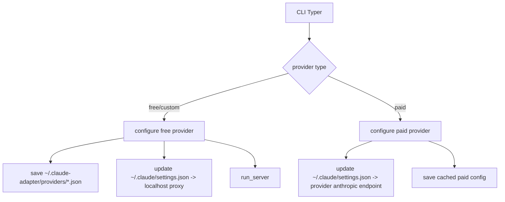

# Claude Adapter Python 项目完备性与技术链分析

## 1. 项目定位与核心目标

`claude-adapter-py` 的核心目标是：

- 将 **Claude Code 发出的 Anthropic Messages API** 请求，转换为 **OpenAI Chat Completions** 请求
- 将上游 OpenAI-compatible 响应再转换回 Anthropic 格式，供 Claude Code 正常消费
- 支持三类接入模式：
  - 免费云端：`NVIDIA NIM`
  - 免费本地：`Ollama`、`LM Studio`
  - 付费直连（不启本地代理服务）：`Kimi`、`DeepSeek`、`GLM`、`MiniMax`、`火山引擎 ARK`

结论：项目方向和实现路径与目标一致，具备可运行的端到端能力。

---

## 2. 技术栈总览

### 2.1 语言与运行时

- Python 3.10+（`pyproject.toml`）

### 2.2 服务框架与网络层

- FastAPI：HTTP API (`/v1/messages`, `/health`)
- Uvicorn：ASGI Server
- httpx：底层 HTTP 客户端（超时、连接池、重试）
- openai Python SDK (`AsyncOpenAI`)：调用 OpenAI-compatible Chat Completions

### 2.3 CLI 与交互

- Typer：CLI 框架
- Questionary：交互式配置
- Rich：命令行表格与展示

### 2.4 数据建模与协议转换

- Pydantic v2：Anthropic/OpenAI/config 模型
- 自定义 converters：
  - 请求转换（Anthropic -> OpenAI）
  - 同步响应转换（OpenAI -> Anthropic）
  - 流式响应转换（native/xml 两套）

### 2.5 配置与观测

- 本地配置存储：`~/.claude-adapter/`
- Claude Code 配置注入：`~/.claude/settings.json`、`~/.claude.json`
- 观测数据：
  - token usage (`token_usage/*.jsonl`)
  - error logs (`error_logs/*.jsonl`)
- 自定义结构化日志器（request scoped）

---

## 3. 程序分层与模块职责

## 3.1 接口层（CLI / HTTP）

- `src/claude_adapter/cli.py`
  - 提供商分类选择（free/paid/custom）
  - 配置录入、保存、复用
  - 免费方案启动本地 FastAPI 代理
  - 付费方案直接写入 Claude 配置并退出（不启动 HTTP 服务器）
- `src/claude_adapter/server.py`
  - 构建 FastAPI app
  - 注册 `/v1/messages` 与 `/health`
  - 端口探测与优雅停机（SIGINT/SIGTERM）

## 3.2 业务入口层

- `src/claude_adapter/handlers/messages.py`
  - 请求解析与 validation
  - Claude 模型名映射为实际 provider 模型
  - 请求转换 -> 上游调用 -> 响应转换
  - 分流 streaming/non-streaming
  - 统一错误处理、usage/error 记录

## 3.3 协议转换层

- `converters/request.py`
  - Anthropic Messages -> OpenAI Chat Completions
  - tool format：`native` / `xml`
  - tool id 去重映射
  - 上下文窗口预算、消息裁剪、`max_tokens` 兜底
- `converters/response.py`
  - OpenAI 同步响应 -> Anthropic 响应
- `converters/streaming.py`（native）
  - OpenAI SSE -> Anthropic SSE
  - 支持 text/tool_use block 增量
  - 流中断时优雅收尾避免任务硬中断
- `converters/xml_streaming.py`（xml）
  - 缓冲文本并提取 `<tool_code name="...">...</tool_code>`
  - 转换为 Anthropic `tool_use` block

## 3.4 配置与基础设施层

- `providers.py`：provider 预设、分类、默认模型、默认上下文窗口
- `models/*.py`：Anthropic/OpenAI/config 数据模型
- `utils/config.py`：配置读写与 Claude settings 注入
- `utils/token_usage.py`、`utils/error_log.py`：观测落盘
- `utils/update.py`、`utils/metadata.py`：版本检查与元数据缓存
- `utils/validation.py`：请求结构验证

---

## 4. 端到端技术链（请求路径）

### 4.1 免费 provider（NVIDIA/Ollama/LM Studio/custom）技术链

1. 用户执行 `claude-adapter-py`
2. CLI 完成 provider + 模型 + tool format + context window 配置
3. 写入 `~/.claude/settings.json`：`ANTHROPIC_BASE_URL=http://localhost:<port>`
4. 启动 FastAPI 代理
5. Claude Code 请求 `POST /v1/messages`
6. `messages.py` 完成 validation + 模型映射
7. `request.py` 转成 OpenAI 请求（native/xml）
8. `AsyncOpenAI.chat.completions.create(...)` 调用上游
9. 根据 stream 模式进入：
   - non-stream：`response.py` 转换后返回
   - stream：`streaming.py` 或 `xml_streaming.py` 转 SSE
10. 返回 Anthropic 格式给 Claude Code

### 4.2 付费 provider（Kimi/DeepSeek/GLM/MiniMax/火山引擎 ARK）技术链

1. 用户执行 `claude-adapter-py`
2. CLI 选择 paid provider
3. 直接写入 `~/.claude/settings.json`：
   - `ANTHROPIC_BASE_URL=<provider anthropic endpoint>`
   - `ANTHROPIC_AUTH_TOKEN=<api key>`
4. 不启动本地代理，Claude Code 直接走 provider Anthropic 兼容端点

---

## 5. 调用关系图（核心）

```mermaid
flowchart TD
    A[Claude Code] --> B[/v1/messages FastAPI]
    B --> C[handlers/messages.py]
    C --> D[utils/validation.py]
    C --> E[converters/request.py]
    E --> F[converters/tools.py]
    E --> G[converters/xml_prompt.py]
    C --> H[AsyncOpenAI Chat Completions]
    H --> I{stream?}
    I -->|no| J[converters/response.py]
    I -->|yes + native| K[converters/streaming.py]
    I -->|yes + xml| L[converters/xml_streaming.py]
    J --> M[Anthropic JSON]
    K --> N[Anthropic SSE]
    L --> N
    M --> A
    N --> A
```



---

## 6. 功能完备性评估（面向“可用性”）

### 6.1 已完备（核心能力）

- Anthropic <-> OpenAI 协议双向转换完整
- streaming/non-streaming 双路径可用
- tool calling 双模式（native/xml）可用
- 多 provider 入口完整，含 paid/free/custom 分类
- Claude Code 配置自动注入能力完整
- 上下文预算与 `max_tokens` 安全兜底已具备
- 错误日志、token usage、请求级日志具备

### 6.2 部分完备（存在一致性或鲁棒性差异）

- **native/xml 流式异常策略不一致**
  - `streaming.py` 异常时走“优雅结束”（`end_turn` + `message_stop`）
  - `xml_streaming.py` 仍可能直接产出 `error` 事件
- **validation 深度有限**
  - 已校验基础结构与类型
  - 对 tools schema、复杂 content 语义约束较浅
- **测试覆盖面偏窄**
  - 现有测试主要覆盖 `tools/xml_prompt`
  - 对 `messages handler`、`streaming`、`request truncation` 缺少系统测试

### 6.3 待增强（工程化）

- 集成测试缺失（尤其 provider mock + SSE 端到端）
- 客户端生命周期管理可再细化（如进程退出时统一 close HTTP client）
- 观测维度可提升（慢请求、重试次数、截断命中率等指标）

---

## 7. 与项目目标的匹配度结论

围绕“将 NVIDIA/OpenAI-compatible 接口转换为 Claude 接口供 Claude Code 调用，并同时覆盖本地部署方案与付费方案”这一目标，项目当前状态可评估为：

- **功能匹配度：高**
- **可运行完备度：高**
- **工程稳健度：中高（需补测试与少量一致性优化）**

一句话结论：  
该项目已经具备生产可用的核心链路，尤其在请求转换、流式转换、provider 配置分流上结构清晰；下一步重点应放在测试覆盖与 native/xml 异常语义统一。

---

## 8. 关键源码索引（按调用顺序）

- 入口与调度
  - `src/claude_adapter/cli.py`
  - `src/claude_adapter/server.py`
  - `src/claude_adapter/handlers/messages.py`
- 协议转换
  - `src/claude_adapter/converters/request.py`
  - `src/claude_adapter/converters/response.py`
  - `src/claude_adapter/converters/streaming.py`
  - `src/claude_adapter/converters/xml_streaming.py`
  - `src/claude_adapter/converters/tools.py`
  - `src/claude_adapter/converters/xml_prompt.py`
- 配置与模型
  - `src/claude_adapter/providers.py`
  - `src/claude_adapter/models/anthropic.py`
  - `src/claude_adapter/models/openai.py`
  - `src/claude_adapter/models/config.py`
- 基础设施与观测
  - `src/claude_adapter/utils/config.py`
  - `src/claude_adapter/utils/validation.py`
  - `src/claude_adapter/utils/logger.py`
  - `src/claude_adapter/utils/error_log.py`
  - `src/claude_adapter/utils/token_usage.py`
  - `src/claude_adapter/utils/update.py`
  - `src/claude_adapter/utils/metadata.py`
  - `src/claude_adapter/utils/file_storage.py`
- 测试
  - `tests/test_converters.py`

---
